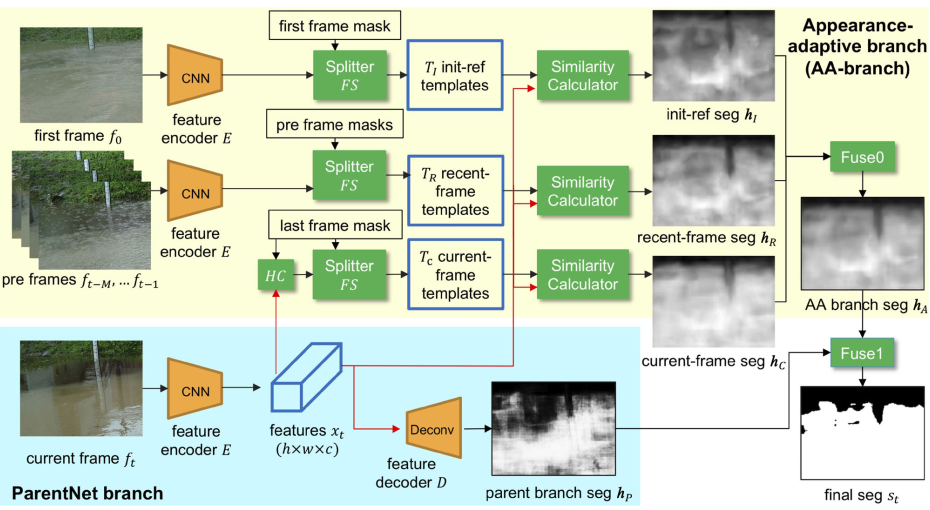
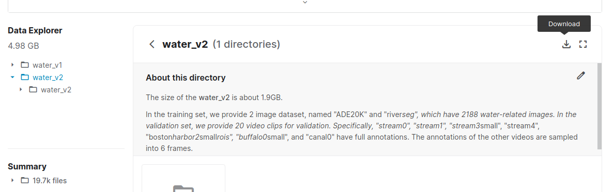

# WaterNetV1

This is an official implementation for the paper "WaterNet: An adaptive matching pipeline for segmenting water with volatile appearance"  Computational Visual Media, 2020: 1-14.



Legacy version: [WaterNetV0](https://github.com/xmlyqing00/LSUWaterSegmentation).

## 1 Prepare environment

### 1.1 Dataset

Download the WaterDataset from [Kaggle](https://www.kaggle.com/gvclsu/water-segmentation-dataset?select=water_v2) and extract it.
It includes training data and evaluation data.


### 1.2 Pretrained model

The [link](http://t.lyq.me/?d=waternet_pretrained) to download the pretrained model.

### 1.3 Setup path
In the `settings.conf`, update the 3rd line `dataset_ubuntu` as the path to the dataset.

## 2 Evaluation

Evaluate the WaterDataset with the pretrained model

```python
python3 eval_WaterNet.py -c=/path/to/cp_WaterNet_199.pth.tar -v <video_name>
```
Make sure the `<video_name>` is in the dataset path (`dataset_ubuntu`) in `settings.conf`.

The results will be saved under the dataset path.

If you want to run your own video, please follow the WaterDataset format.
 
Update: We set new hyper parameters to obtain better segmentation results. 
In `settings.conf`, `r0=r1=4`.
In `eval_WaterNet.py`, `l0, l1, l2 = 0.5, 0.3, 0.2`.  


## 3 Retrain the model
```python
python3 train_WaterNet.py
```

## 4
If you use our codes or dataset in your research, please cite our paper.
```bibtex
@article{liang2020waternet,
  title={WaterNet: An adaptive matching pipeline for segmenting water with volatile appearance},
  author={Liang, Yongqing and Jafari, Navid and Luo, Xing and Chen, Qin and Cao, Yanpeng and Li, Xin},
  journal={Computational Visual Media},
  pages={1--14},
  year={2020},
  publisher={Springer}
}
```
It's free for academic research. For commercial usage, please contact email xinli@cct.lsu.edu.
